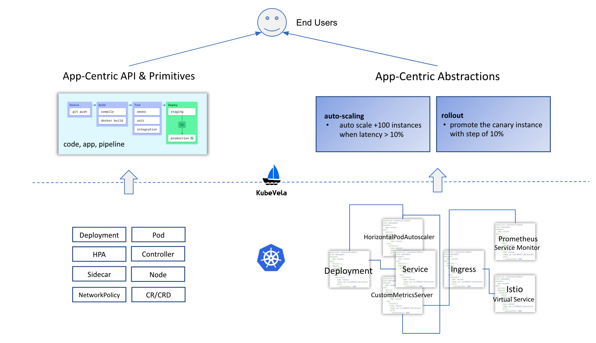
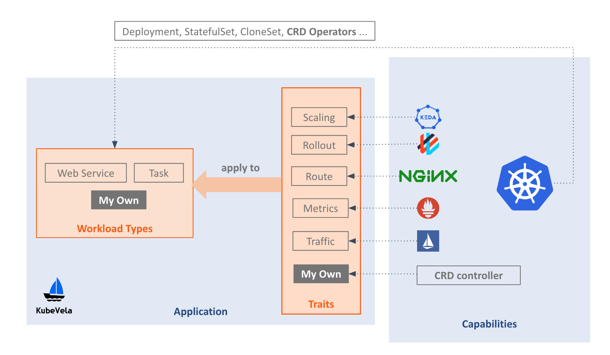
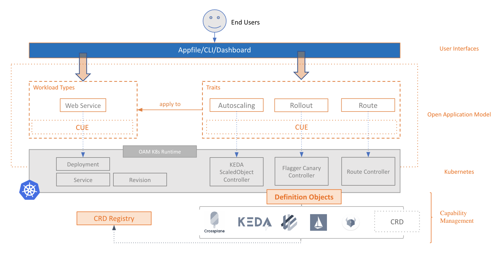

# KubeVela Design

This document is the detailed design and architecture of the KubeVela being built in this repository.

> All the diagram in this documentation could be found in [this slides](https://docs.google.com/presentation/d/1Y3gnKrd7fUZGgee7Ia9vBsRIYhcZLQwMUCDkk1RJvQc/edit?usp=sharing).

## Overview

KubeVela is a simple, complete, but highly extensible cloud native application platform based on Kubernetes. KubeVela intends to bring application-centric experience to end users and democratize building cloud native application platforms for platform engineers.

## User Stories

As a end user (e.g. application developers, operators etc) of the platform, I only want to focus on coding my business logic and ship them to various environments at ease. Let's say:
- Here's my source code.
- Here's my application configuration (described in end user PoV).
- Deploy it in test environment.
- Deploy it in production environment.
- Monitoring, debugging, rollout/rollback the application.
- Dockerfile is fine, but please keep it simple. 

As a platform engineer, I want to build a easy-to-use platform for end users. In detail, the platform should be:
- Heroku-like (_in terms of both user experience and functionality_). 
  - and I prefer to build my own version with OSS tools, particularly, with Kubernetes (for obvious reason).
- Easy to build. 
  - I am too busy to reinvent any wheel, I want to reuse every capability in Kubernetes community as possible,  with minimal effort. Writing some simple CRD and controllers is fine, but please, just the simple ones like copy-paste.
- Powerful and highly extensible.
  - I don't want to lock users with restricted abstractions and capabilities like traditional PaaS or FaaS/Serverless. I love Kubernetes and what it has enabled. So in terms of capability, I hope my platform is fully open and has unlimited possibilities like Kubernetes itself, rather than another opinionated close system like traditional PaaS.


## Core Principles

In nutshell, the principles for KubeVela project are:

- For end users, it out-of-the-box provides a fully featured PaaS-like experience, nothing special.
- For platform builders, it works like a special Kubernetes "distro" or extensible PaaS core that could be used to build something more complex on top of. It allows platform builders to integrate any existing capabilities in Kubernetes ecosystem to end users with minimal effort, or develop a new capability at ease in a standardized and Kubernetes-native approach.

## Design Details

### 1. Application Centric

The API and interfaces of KubeVela intends to make users think in terms of application, not containers or infrastructure. 

Lacking application context impacts the user experience and significantly raised the bar to adopt cloud native stack. We believe "application" is the natural mindset of developers and it's the core concept an application platform should expose.



KubeVela intends to let developers push code, define application in developer facing primitives, and make daily operations as configurations of the application.  

Thus, KubeVela choose to:
1. Introduce "application" as first class citizen and main API.
2. Build the whole system around "application", i.e. model capabilities of Kubernetes as application configuration, with clarity and manageability.

#### Solution

Instead of creating a in-house "application CRD", KubeVela adopts [Open Application Model (OAM)](https://github.com/oam-dev/spec) as its application definition, since OAM:
1. defines micro-services application by default.
2. models day 2 operations as part of the application (i.e. `Application Traits`).
2. is highly extensible: every workload and trait in OAM is a independent definition, no abstraction or capability lock-in.

### 2. Capability Oriented Architecture

To enable platform builders use KubeVela to create their own application platforms in an easy and Kubernetes native approach, KubeVela intends to make its every capability a standalone "plug-in".



For example, there are several "built-in" workload types in KubeVela such as `Web Service` or `Task`. It is by design that they are all independent CRD controllers that abstract Kubernetes built-in workloads and create Service automatically if needed. KubeVela itself is **NOT** aware of the specification or implementation of these workload types.

This means platform builders are free to bring their own workload types by simply install a CRD controller, or even just reference a k8s built-in resource like StatefulSet as new workload type.

Similarly, all the "built-in" operations such as `scaling` or `rollout` (i.e. "traits" in KubeVela) are also independent CRD controllers which are **NOT** bound with specific workload types. Platform builders are free to bring their own traits implementations by simply providing a CRD controller, reference a k8s built-in resource like `HPA` or `NetworkPolicy` as trait is also possible.

This loosely coupled design of KubeVela adopts the idea of Capability Oriented Architecture (COA), i.e. instead of creating a close system like traditional PaaS, KubeVela intends to become an application-centric framework to connect end users with underlying infrastructure capabilities.

#### Solution

KubeVela core is built with [OAM Kubernetes Runtime](https://github.com/crossplane/oam-kubernetes-runtime) which met the requirements of KubeVela such as supporting bring in standalone controllers as workload type and trait, it also defined a clear interface between how a trait could operate a workload instance in a generic approach. Overall, this library defined a set of abstraction and interfaces for platform builder to assemble various Kubernetes capabilities into a PaaS without coupling them together or introducing any glue code.  

##### Capability Register and Discovery

KubeVela leverages [OAM definition objects](https://github.com/oam-dev/spec/blob/master/4.workload_definitions.md) to register and discover workloads and traits:


```console
$ kubectl apply -f workload-definition.yaml # register a new workload type
$ kubectl apply -f trait-definition.yaml # register a new trait
```

Note that OAM definition objects only care about API resource, not including the controllers. Thus KubeVela intends to include a **CRD registry** so whenever a new API resource is installed as workload or trait, KubeVela could install its controller automatically from the registry. That of course means we envision the CRD registry could register a CRD and Helm chart (which contains the manifest of the controller). In practice, we are currently evaluating RedHat's Operator Lifecycle Manager (OLM) but no the final conclusion yet.

##### Cloud Services Integration

For capabilities like cloud services, KubeVela intends to leverage Kubernetes as the universal control plane so [Crossplane](https://github.com/crossplane/crossplane) core will be used to register cloud services as workload types.


### 3. Extensible User Interface

KubeVela is built with Kubernetes and OAM (which adopts Kubernetes API model). So in nutshell, **ALL** functionalities of KubeVela core can be handled by simple `kubectl`, for example:

```yaml
$ kubectl apply -f frontend-component.yaml # create frontend component
$ kubectl apply -f backend-component.yaml # create backend component
$ kubectl apply -f application-config.yaml # assign operational traits to components and deploy the whole application
```

We call these server side objects "the application model of KubeVela", they are essentially the Kubernetes API objects KubeVela exposes.

However, we also agree that Kubernetes API model is great to build platforms like KubeVela with but when directly exposed to end users, it creates heavy mental burden and high learning curve. Hence, as any other user facing platforms, KubeVela intend to introduce a lightweight user facing layer with following goals in mind:

- Shorten the learning curve of new developers. Most capabilities in KubeVela are developed by big
companies that run very complex workloads. However, for the bigger developer community, the new user facing layer will provide a much simpler path to on-board KubeVela.
- Developers can describe their applications and behavior of their components without making assumptions on availability of specific Kubernetes API. For instance, a developer will be able to model auto-scaling needs without referring to the CRD of auto-scaling trait.
- Provides a single source of truth of the application description. The user facing layer allows developers to work with a single artifact to capture the application definition. This artifact is the definitive truth of how the application is supposed to look like. It simplifies administrative tasks such as change management. It also serves as an anchor for application truth to avoid configuration drifts during operation.
- Highly extensible. For example, when a new workload type or trait is installed, the end users could access this new capability directly from user interface layer, no re-compile or re-deploy of KubeVela is required.

#### Solution

We concluded such "highly extensible user interface layer" as a need for a dynamic "modeling language" on top of the KubeVela's application model objects. After evaluation, we decided to adopt [CUElang](https://github.com/cuelang/cue) since it's perfect as a pure data configuration language that allow us to build developer facing tools, nothing more, nothing less.

In detail, we integrated CUE based abstraction as part of OAM implementation since the *abstraction* and *model* are closely related. For platform builders, every workload or trait definition in KubeVela references a CUE template as its abstraction between human and the underlying Kubernetes capability, platform builders are free to modify those templates at any time

On the other hand, it's by intention that the end users of KubeVela don't need to learn or write CUE. Instead, we created following tools for them by leveraging above OAM + CUE user interface layer:

1. A command line tool.
2. A GUI dashboard.
3. A Docker Compose style `appfile`.

For example, the `vela cli`:

```console
$ vela svc deploy frontend -t webservice --image oamdev/testapp:v1 --port 80 --app helloworld
```

The `-t webservice --image oamdev/testapp:v1 --port 80` arguments are not hard coded, they are schema defined by in-line CUE template of `WebService` workload definition.

The `appfile` is essentially a YAML version of command line tool but it can support more complex structures with a single command like `$ vela up`:


The schema of above `appfile` is not hard coded as well, they are organized following OAM and enforced by CUE templates of `WebService` workload definition, `Scaling` trait definition and `Canary` trait definition.

> Appfile has its [independent design doc](./design/appfile-design.md) which includes more details. There's also [an example](./design/appfile-design.md#multiple-outputs-in-traitdefinition) showing how platform builder could use CUE to define a `route` capability in KubeVela.

We will skip the example of dashboard, but similarly, the schema of GUI forms are defined by in-lined CUE template of definition objects.

## Architecture



From highest level, KubeVela is composed by only two components:

### 1. User interface layer
Including: `cli`, `dashboard`, `appfile`, they are all client side tools based on the CUE based abstractions mentioned above.
### 2. KubeVela core
Including:
  - [OAM Kubernetes runtime](https://github.com/crossplane/oam-kubernetes-runtime) to provide application-centric building blocks such as `Component` and `Application` etc.
  - [Built-in workload and trait controllers](https://github.com/oam-dev/kubevela/tree/master/pkg/controller/v1alpha1) to provide core capabilities such as `webservice`, `route` and `rollout` etc.
  - Capability Management: manage features of KubeVela following Capability Oriented Architecture. 
    - Every feature of KubeVela is a "addon", and it is registered by Kubernetes API resource (including CRD) leveraging OAM definition objects.
    - CRD Registry: register controllers of Kubernetes add-ons and discover them by CRD. This will enable automatically install controllers/operators when CRD is missing in the cluster.
